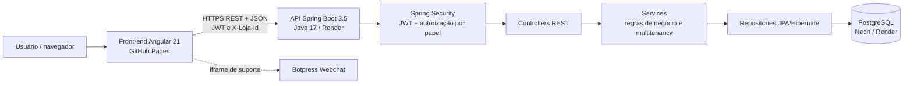
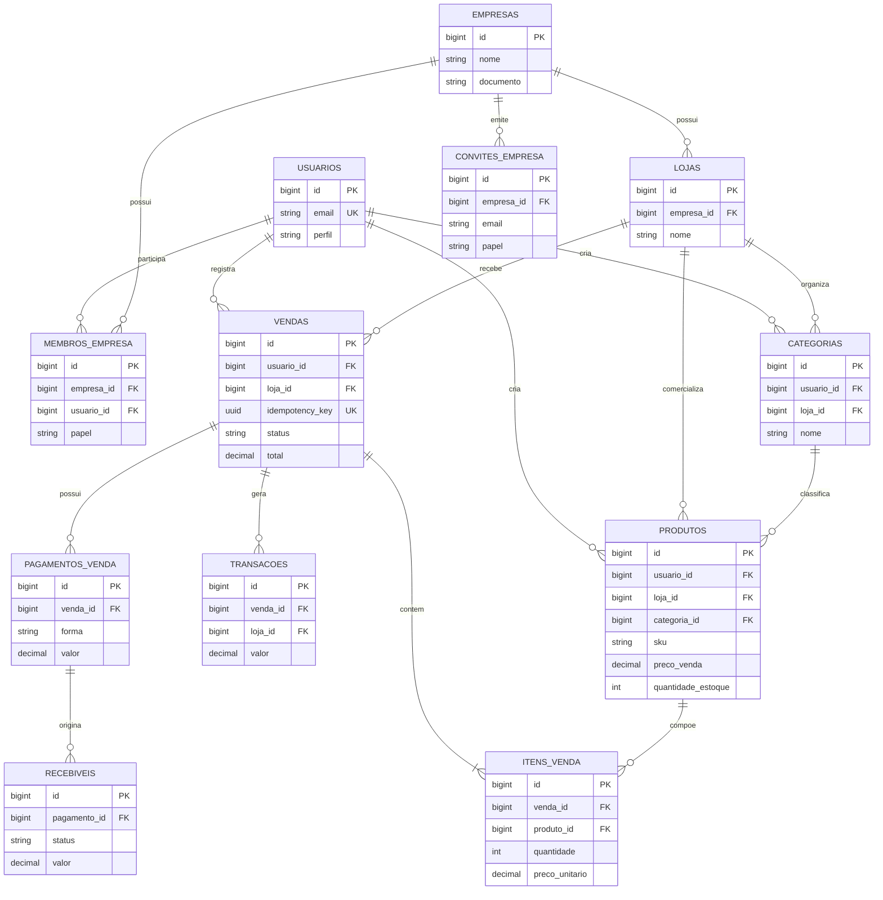

# 6 Arquitetura do Sistema

## 6.1 Visão Geral da Arquitetura

**Figura 14 – Arquitetura do Sistema Atualizada**

Fonte: Elaborado pelos autores (2026).

## 6.2 Tecnologias Utilizadas

| Camada | Tecnologia | Finalidade |
|---|---|---|
| Front-end | Angular 21, TypeScript, Tailwind CSS | Interface web responsiva, dashboards e navegação por rotas |
| Back-end | Java 17, Spring Boot 3.5, Spring Web, Spring Security | API REST, autenticação, autorização e regras de negócio |
| Persistência | Spring Data JPA / Hibernate | Mapeamento objeto-relacional e acesso transacional aos dados |
| Banco de Dados | PostgreSQL (Neon) | Armazenamento relacional multiempresa |
| Autenticação | JWT | Sessões stateless com expiração e validação no back-end |
| Suporte | Botpress Webchat | Atendimento automatizado integrado à interface |
| Deploy | Docker, Render e GitHub Pages | Empacotamento, hospedagem da API e publicação do front-end |
| Versionamento | Git / GitHub | Controle de versões e integração contínua |
| Gestão | Trello | Organização das atividades |

## 6.3 Comunicação entre as Camadas

O usuário acessa o front-end Angular publicado no GitHub Pages. A aplicação utiliza serviços e interceptors para enviar requisições HTTPS à API REST hospedada no Render. O interceptor de autenticação acrescenta o token JWT no cabeçalho `Authorization`; o interceptor de loja acrescenta `X-Loja-Id`, identificando a unidade ativa sem confiar apenas em parâmetros fornecidos pela interface.

As requisições chegam aos controllers do Spring Boot, passam pelo filtro de autenticação e autorização e são encaminhadas aos services. Os services validam os dados, aplicam as regras de negócio e consultam os repositories JPA. O Hibernate traduz as operações para SQL parametrizado no PostgreSQL. As operações de venda e estoque são executadas em transações, preservando consistência e idempotência. As respostas são serializadas em JSON e retornam ao front-end, que atualiza os componentes e dashboards.

O balão de suporte é carregado como webchat do Botpress no front-end e funciona de forma independente da API de negócio.

## 6.4 Banco de Dados

**Figura 15 – Modelo / Estrutura do Banco de Dados**

Fonte: Elaborado pelos autores (2026).

As entidades são separadas por empresa e loja. `membros_empresa` define o papel do usuário (`PROPRIETARIO`, `ADMINISTRADOR`, `GERENTE` ou `OPERADOR`), enquanto `loja_id` e `usuario_id` são utilizados para manter o isolamento dos dados. Produtos relacionam-se a categorias e lojas; vendas possuem itens, pagamentos, transações e recebíveis. Chaves estrangeiras, unicidade por loja, restrições de status e limites de parcelas protegem a integridade. A chave de idempotência evita duplicação de vendas em reenvios da mesma requisição.
